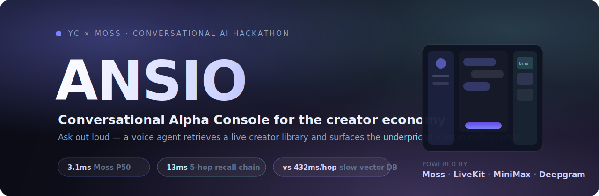
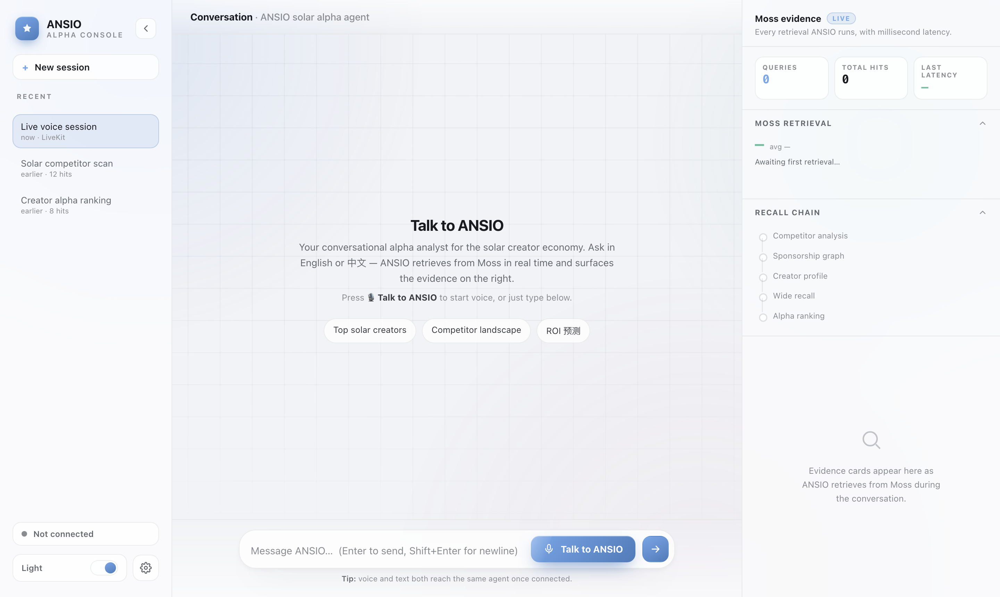
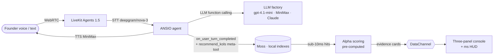
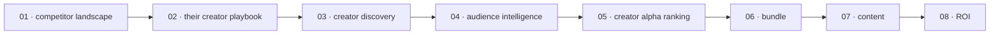

<div align="center">



<h1>ANSIO · Conversational Alpha Console</h1>

**A voice-native growth analyst for the creator economy.**
Ask out loud — ANSIO retrieves a live creator library through **Moss** in
milliseconds and surfaces the *underpriced* creators, with every retrieval
shown as it happens.

<sub>ANSIO — <i>Artificial Narrative &amp; Signal Intelligence Operating system</i></sub>

[](https://www.livekit.info/conversational-ai-hackathon)
[](https://www.moss.dev)
[](https://docs.livekit.io/agents/)
[](https://www.minimax.io)
[](LICENSE)
[](#)
[](#)

</div>

---

## 🎬 Demo

<div align="center">



*Left: sessions · Centre: voice + text conversation · Right: the live Moss evidence stream with millisecond HUD.*
**Talk** → ANSIO scores the creator library and the recall chain lights up in real time.

> ▶️ To capture an animated walkthrough, see [`assets/RECORD_DEMO.md`](assets/RECORD_DEMO.md) — record one voice turn on the running app and drop it in as `assets/demo.gif`.

</div>

---

## 🧩 The problem

Influencer pricing is a **black box**, and the market prices creators by
**follower count instead of real value**:

- The same creator quotes wildly different rates to different brands; public
  rates are nearly impossible to scrape.
- Within one niche, **cost-per-thousand-followers varies by orders of
  magnitude** — the market is *mispricing* talent everywhere.
- Finding the genuinely *undervalued* creator means a human scrolling for a
  week, eyeballing follower counts that don't track real influence.

## 💡 What ANSIO does

ANSIO is a **Bloomberg terminal for creators**. A founder describes a growth
goal in plain speech; ANSIO runs a real, multi-hop retrieval over a creator
library and ranks candidates by **alpha = real value ÷ asking price** — the
gap between what a creator is worth and what the market charges.

> **Underpriced ≠ cheap.** Alpha rewards *high value at a low price*, not low
> price alone.

## ✨ Key features

| | |
|---|---|
| 🎙️ **Voice-native** | Talk or type — both reach the same agent. Real LiveKit WebRTC session with **streaming captions** that update in place, not a transcript box. |
| ⚡ **Moss real-time recall** | A 5-hop retrieval chain measures **~9 ms** end to end (P50 **1.8 ms**/hop, warm). A slow vector DB (~432 ms/hop) would stall the conversation for ~2 s. |
| 🎬 **Staged story reveal** | Cards don't dump at once — the right rail advances **beat by beat with the consultation** (competitors → their playbook → similar-but-underpriced → alpha shortlist), enforced by an eval-tested tool-ordering discipline. |
| 📊 **Alpha ranking** | Pre-computed 7-signal scoring; Moss only *retrieves* at runtime, so the answer is instant. |
| 🧠 **Consent-gated memory** | Toggle **Memory** on and ANSIO distills each call into a user profile stored in Moss — next session it greets you knowing your product, platform and budget. Toggle off = zero reads, zero writes. One-click profile reset. |
| 🗂️ **Real session history** | Sessions persist locally with their transcripts **and** their evidence streams — open any past consultation and the right rail replays its full card chain. |
| 🌐 **Language modes** | EN / 中文 / Auto from settings — one language per reply (no mid-sentence mixing), wired through prompt, STT model and TTS voice. |
| 🪟 **Live evidence stream** | Every retrieval pushes a designer-faithful card (sim-bars, donut, 4-column alpha leaderboard) with a real millisecond HUD **plus a per-reply voice-latency badge** — you *watch* Moss work. |

## 🏗️ How it works



**The staged reveal** — the conversation *is* the demo. Each founder reaction
advances exactly one step, and that step's retrieval paints its card on the
right rail (an 8-beat evidence chain, mirroring a real consultation):



Stage ordering is enforced two ways: a hard tool-ordering discipline in the
system prompt (regression-tested by `tests/staged_flow_eval.py` against the
live brain) and a per-turn card-type guard in the agent. Each hop is a Moss
query at ~2 ms (P50 1.8 ms, measured warm); a full 5-hop recall chain is
**~9 ms** of retrieval. That speed is the product — at 432 ms/hop the agent
would talk over a 2-second pause. **This is why it has to be Moss.**

## 🛠️ Built with

| Tool | Role |
|------|------|
| [**Moss**](https://www.moss.dev) | Real-time semantic search — the multi-hop recall engine **and the agentic memory store** (user profiles). Cloud-first with a zero-quota **on-device session-index fallback**. *Sub-10 ms, zero infra.* |
| [**LiveKit Agents 1.5**](https://docs.livekit.io/agents/) | Realtime voice pipeline (STT · turn detection · WebRTC transport + DataChannel). |
| [**MiniMax**](https://www.minimax.io) | Bilingual TTS voice; hot-swappable LLM option in the model factory. |
| [**LiveKit Inference**](https://docs.livekit.io/agents/models/inference) `gpt-4.1-mini` | Default function-calling brain (env hot-swap: MiniMax-M2 / Claude). |
| [**Deepgram**](https://deepgram.com) `nova-3` | Speech-to-text — multilingual model, with a dedicated Mandarin model when 中文 mode is selected. |

## 🚀 Quickstart

```bash
git clone https://github.com/SkylarWJY/ANSIO-conversational.git
cd ANSIO-conversational

# 1. Backend deps (LiveKit worker + Moss tools + token server)
cd agent-py && uv sync && cd ..

# 2. Secrets — copy the template and fill in your own keys (never commit .env)
cp agent-py/.env.example agent-py/.env
#   LIVEKIT_URL · LIVEKIT_API_KEY · LIVEKIT_API_SECRET
#   MOSS_PROJECT_ID · MOSS_PROJECT_KEY · MINIMAX_API_KEY

# 3. Build the Moss indexes (generates synthetic + public-field data)
cd agent-py && uv run python src/build_indexes.py && cd ..

# 4. Run everything (single origin on :8788 — page + /token, plus the worker)
pm2 start ecosystem.config.cjs        # web + token + agent worker
# …or run the three processes manually (see ecosystem.config.cjs header)

open http://localhost:8788/            # grant the mic, then click "Talk to ANSIO"
```

> One port (`8788`) serves the static console **and** the LiveKit token
> endpoint, so a single SSH tunnel (`ssh -L 8788:localhost:8788 …`) drives the
> whole demo — LiveKit media flows directly to the cloud, not through the tunnel.

## 📁 Project structure

```
ANSIO-conversational/
├── app/                 # three-panel voice console (vanilla JS, zero build)
│   ├── index.html       #   left rail · centre conversation · right evidence stream
│   ├── bridge.js        #   LiveKit web bridge (connect · mic · audio · DataChannel)
│   └── vendor/          #   livekit-client UMD
├── agent-py/            # LiveKit Agents worker
│   └── src/             #   agent.py · llm_factory · 5 tools + recommend_kols meta-tool
│                        #   memory (consented profiles) · lang (EN/中/Auto modes)
│                        #   moss_router (on-device fallback) · scoring · events
├── token_server.py      # FastAPI: signs LiveKit JWTs + serves the static site
├── ecosystem.config.cjs # pm2 process map (local dev)
└── demo/                # original landing demo
```

## 🔒 Data & confidentiality

ANSIO is built on **public creator fields** (name, handle, follower count,
collaborated brands) plus a **synthetic** dataset. Any real deal pricing is
collapsed into an *aggregated* benchmark only; individual quotes never enter the
indexes, never appear on screen (the UI shows **“Estimated Market Cost”**), and
raw data files are git-ignored. Credentials live only in a git-ignored `.env`.
User memory is **opt-in**: profiles are written to Moss only while the Memory
toggle is on; switched off, the agent performs zero profile reads or writes,
and a one-click reset deletes the stored profile.

## 👥 Team

Built by a cross-border team for the YC × Moss Conversational AI Hackathon.

| | Role |
|---|---|
| [**@baizhiyuan**](https://github.com/baizhiyuan) | Backend — LiveKit agent, Moss retrieval & recall chain, alpha scoring, token server |
| [**@SkylarWJY**](https://github.com/SkylarWJY) | Frontend — three-panel console design & demo |
| [**@clfhaha1234**](https://github.com/clfhaha1234) | Product — PRD & retrieval contract |

<sub>Engineered with [Claude Code](https://claude.com/claude-code).</sub>

## 🙌 Acknowledgements

Built in 24 hours for the **YC × Moss Conversational AI Hackathon**.
Thanks to **Moss**, **LiveKit**, **MiniMax**, **Deepgram**, and **Y Combinator**
for the tools and the arena.

## 📄 License

[MIT](LICENSE) © 2026 ANSIO Team
